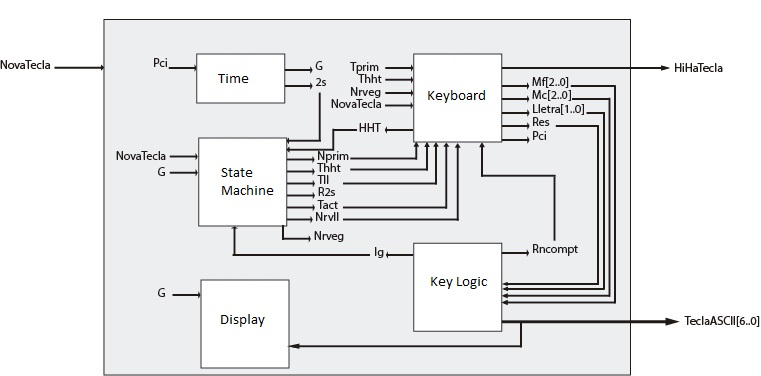

# Phase One #

The main objective in this phase is to interact with the user and communicate with the next phase in order to process the 
game logic.

## Time Diagram
The time diagram of the signals both generated or received, is shown below

Although it is in Catalan, signals are translated as:
* HiHaTecla - Key is pressed
* NovaTecla - Phase Two input asking for a new letter
* TeclaASCII - It is the key pressed represented in ASCII

Also, have in mind that a key is only send after 2 seconds have passed since it was pressed. (As shown in orange)

## Integrated Circuits Used
* High Performance CMOS EPROM to convert from the keyboard to the ASCII letter. 
* GAL22V10 for both the state machine and the 16 segments
* 74LS TTL
  * 74LS14 - Hex Inverter with Schmitt Trigger Inputs
  * 74LS32 - OR Gates
  * 74LS74 - Dual D-Type Positive-edge-triggered flip-flops
  * 74LS173 - 4 bit d-type register with 3-state outputs
  * 74LS682 - 8-bit comparator
  * 74LS161 - Synchronous 4-bit counter
 * Ne555 oscillator

### Electric Shema

## Board

Finally, this picture shows how does the Phase One looks once its soldered. (Sorry for the bad image quality, the bad lighting
and the excessive image processing the phone did, messed it up)

The paper covering the EPROM is used to protect data integrity, as they are erased with ultra-violet light and 
in some cases, data gets corrupted even with normal lighting.

