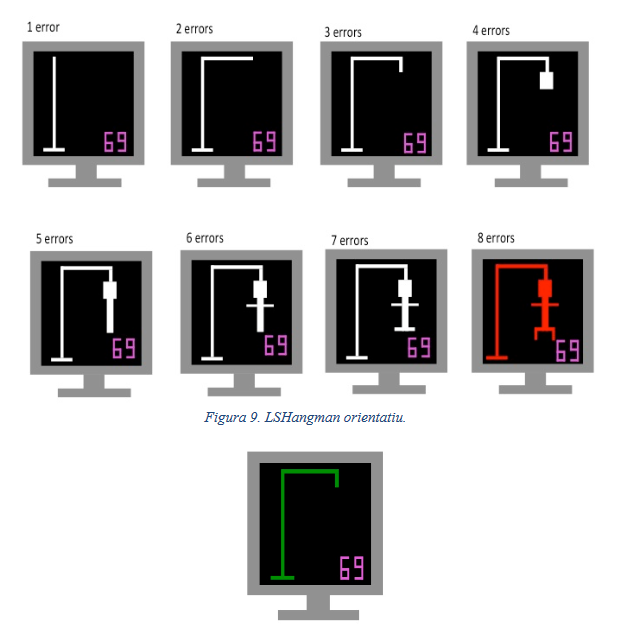
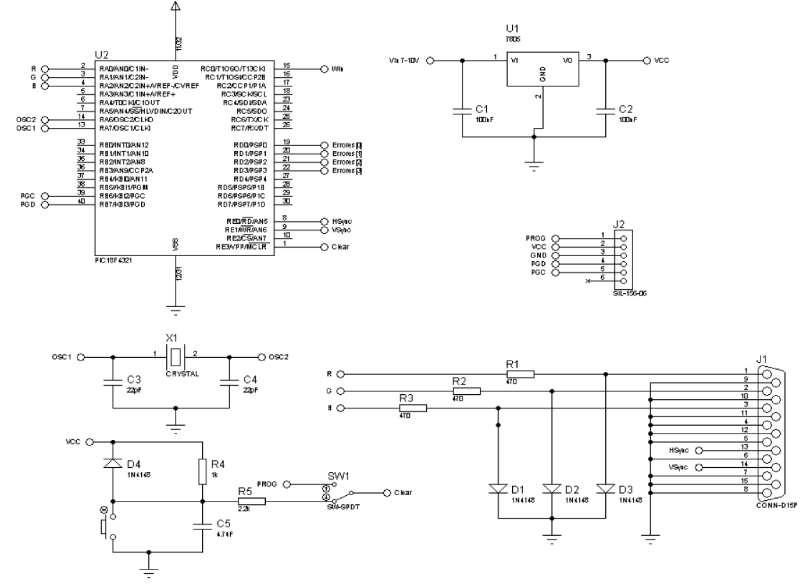

# Phase Three #

Finally, the main objective of this phase is to display the current game through a VGA connector. 

## Display States
The following image shows the different states of the game.

## Integrated Circuits and components used
* PIC18F4321 functioning at 40Mhz
* XTAL 10Mhz
* L7805T

### Electric Shema

