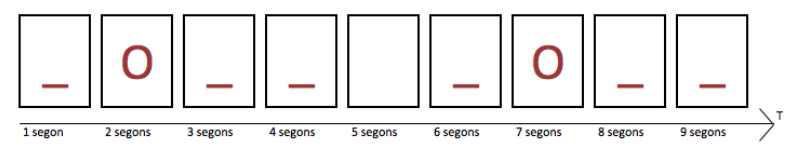
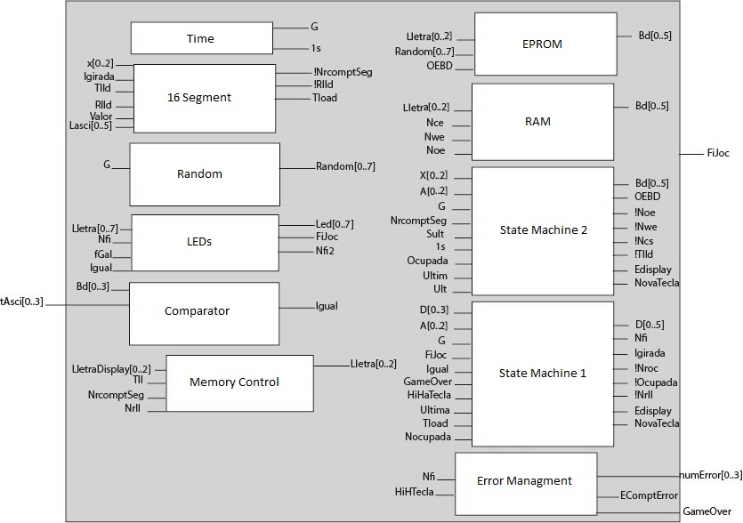
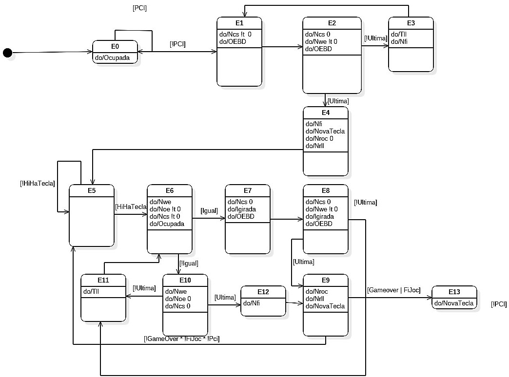
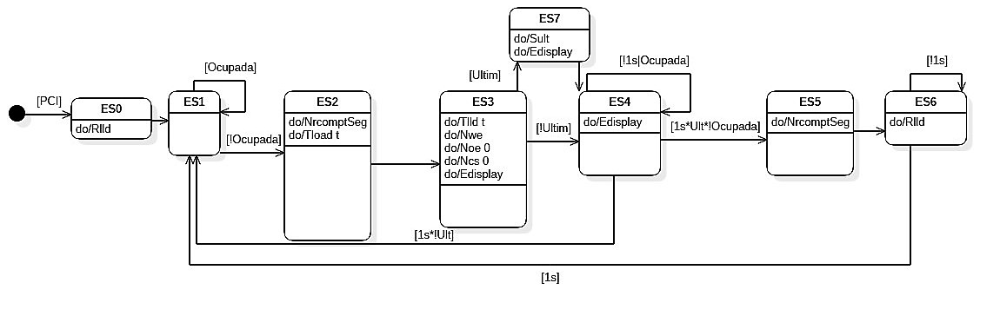
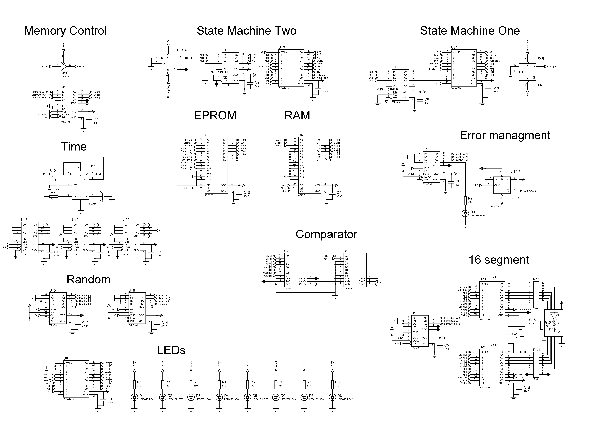
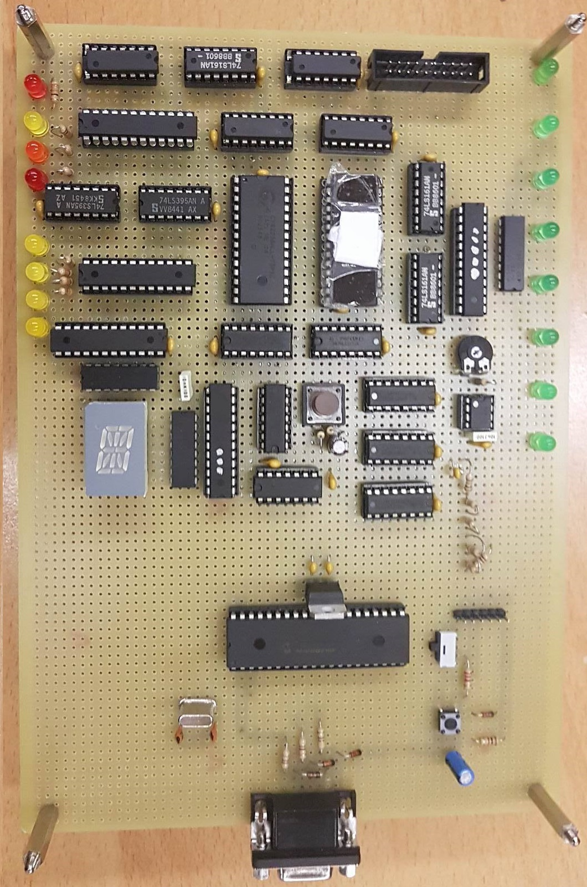

# Phase Two #

This phase realizes all the game logic. It will select the word previously stored in the EPROM randomly and the player will have to guess it. The user will have a maximum of 8 errors to win. 

The visual part of the game, will consist of two blocks

### LEDs ###
Eight LEDs will show the letters that have been guessed or are still unknown, so when the LED is on, the player hasn't guess it and when it's off, the user has guess it correctly.

### 16 Segment ###
The 16 segments will be in charge of showing the entire word like a circular array. As shown below for the word "Hola"

## Input/Output diagram

Most important signals:
### Outputs ###
* NovaTecla  - Output asking phase one for a new letter
* NumError(0..3) - Number of errors the user has made, useful for showing the game state in phase three.
* GameOver - Signal telling to phase three that the game is over

### Inputs ###
This inputs are from phase one.
* HiHaTecla  - Key is pressed 
* TeclaASCII(6..0)  - ASCII value of the key pressed

## State Machine One
This is the main state machine that controls the logic of the game. 

## State Machine Two
This auxiliary state machine, is used to show the letter to the 16 segments cyclically.

## Integrated Circuits Used
* High Performance CMOS EPROM to select a random word. 
* GAL22V10 for the state machines, the 16 segments and the LEDs.
* 74LS TTL
  * 74LS85 - 4-bit comparator
  * 74LS74 - Dual D-Type Positive-edge-triggered flip-flops
  * 74LS161 - Synchronous 4-bit counter
  * 74LS395 - 4-bit cascadable shift register with 3-state outputs
 * Ne555 oscillator
 * IS62C256 LOW POWER CMOS STATIC RAM to store the word and check if a key was previously selected.

### Electric Shema

## Board

Finally, this picture shows how does the Phase Two looks once its soldered. As we managed to use only half of the board, we used the extra part to solder the next phase.

As said in the past phase, the paper covering the EPROM is used to protect data integrity, as they are erased with ultra-violet light and in some cases data gets corrupted even with normal lighting.

