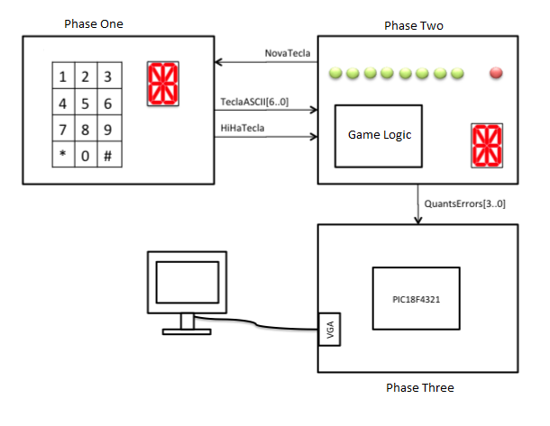
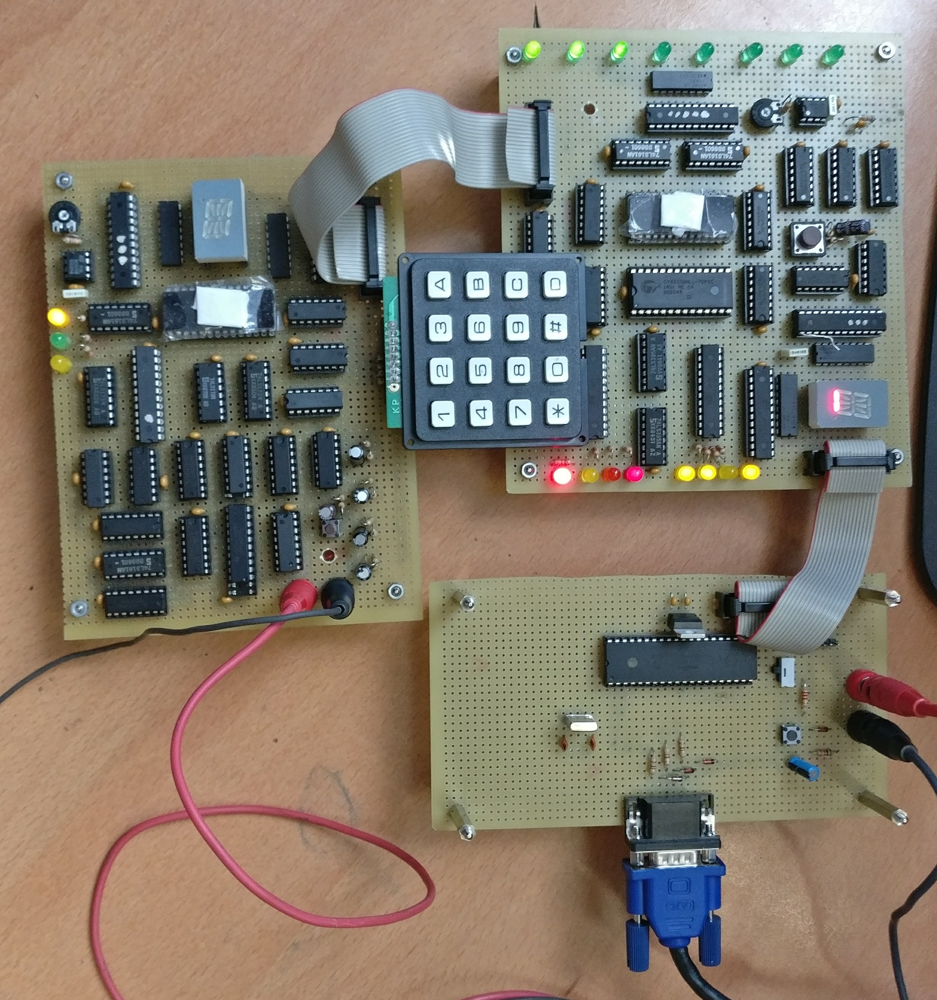

# Hangman

This is a project that aims to create the famous game Hangman using TTL 74LS Series integrated circuits and the microcontroller
PIC18F4321. It is separated in three phases:

## [Phase One](PhaseOne/)
 

The first one, manages all the user input, sending it to the next phase so it can process the game logic.
At the same time, using a 16-segment display, shows what letter is being selected in order to make it more user friendly. 

## [Phase Two](PhaseTwo/)

Phase two is considered the "brain" controlling all the game logic based on inputs from phase one. Depending on the game state it
will show how many letters you got left and send to the phase three the number of errors you've done. 

## [Phase Three](PhaseThree/)

Finally, this phase is only focused on the visual part of the project. It will show the game state in a display through a 
VGA connector, based on the number of errors the user has committed.

A visual idea of how the project works is shown below

## Videos and Photos

### Win
This word that the user correctly guessed was "Gato".

### Won state
This video shows how the game is locked at the won state. The word was "Pez"

### Lost
Finally this video shows how the game reacts when the user failed.

Although each phase is better explained in their respective folders, here is an image of how all of them are connected.

* __Left__ - Phase One
* __Bottom__ - Phase Three
* __Up Right__ - Phase Two

